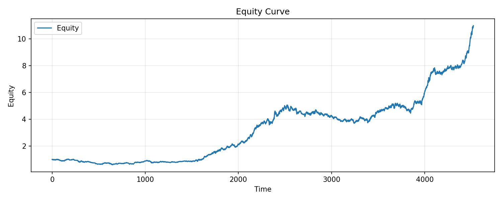

# Crypto AI Swing Bot

Adaptive, risk-aware cryptocurrency trading bot for **BTC/USDC futures**, built for
consistent performance and disciplined execution.

This project focuses on:
- operating across **uptrend, downtrend, and sideways markets**
- using **pullback & breakout signals** to capture directional moves
- **minimizing trading frequency** while maximizing trade quality
- **protecting capital** with strict daily risk limits
- **backtesting strategies realistically** before live deployment

---

## 🚀 Features

| Component | Status | Description |
|----------|--------|-------------|
| Market Data | ✔ | Live & historical USDⓈ-M futures OHLCV via CCXT |
| Indicators | ✔ | EMA, SMA, RSI, MACD via built-in indicator engine |
| Market Regime Detection | ✔ | Uptrend / Downtrend / Sideways classification |
| Strategy Engine | ✔ | Pullback longs, pullback shorts, sideways breakout |
| Trade Limiter | ✔ | Max trades/day + daily PnL caps |
| Daily Reset | ✔ | Reset at US Market Open (9:30 AM ET) |
| Paper Broker | ✔ | Simulated execution for backtesting |
| Backtesting | ✔ | Full walk-forward simulation |
| AI Filter | ⏳ optional | Placeholder for trade-quality evaluation |
| Live Trading | ✔ | Binance USDⓈ-M futures auto execution (opt-in) |

---

## 🧠 Philosophy

The bot is designed to:
- take **fewer, higher-probability trades**
- avoid **low-quality sideways chop**
- **enter during liquidity-rich periods**
- use **clear, explainable rules**

This improves survivability and reduces churn.

---

## ✅ Current Status

- Live trading loop implemented and gated by `ENABLE_LIVE_TRADING`
- Mean Reversion strategy tuned for consistency (RSI 32/68, ATR mult 1.0, stretch 0.006, ATR stretch 0.75)
- Futures and local BTC/USD backtests updated with fee modeling

---

## 📦 Installation

```bash
pip install -r requirements.txt
```

Recommended Python version: `>= 3.9`

Visualization requires `matplotlib` (included in `requirements.txt`).

---

## 🧪 Run a Backtest

```bash
python3 src/backtesting/run_backtest.py
```

The default configuration tests:
- BTC/USDC futures
- 1 hour timeframe
- 2023-01-01 → 2025-01-01

Modify the dates in `run_backtest.py` to test other periods.

---

## ▶️ Live Loop (Disabled by Default)

`src/main.py` runs the live trading loop. It will **not** place orders unless
`ENABLE_LIVE_TRADING=true` is set in `.env`.

---

## ⚡ Live Trading (Auto Execution)

Live trading uses Binance USDⓈ-M futures on BTC/USDC and **will place real orders**.
Set the following in `.env` before running:

```
ENABLE_LIVE_TRADING=true
BINANCE_API_KEY=...
BINANCE_API_SECRET=...
```

Optional risk configuration (defaults shown in `.env.example`):
- `RISK_PER_TRADE` (default 0.01 = 1% of equity at risk per trade)
- `MAX_DAILY_LOSS_PCT` (default 0.02)
- `MAX_TRADES_PER_DAY` (default 5)
- `LIVE_LEVERAGE` (default 1)
Strategy parameters (defaults shown in `.env.example`):
- `RSI_LOW` / `RSI_HIGH` (default 32 / 68)
- `ATR_MULT` (default 1.0)
- `MIN_STRETCH` (default 0.006)
- `MIN_STRETCH_ATR_MULT` (default 0.75)

Start the live loop:

```bash
python3 src/main.py
```

---

## 🧠 Strategy (Mean Reversion Variant)

The current backtests use a mean-reversion rule set designed to capture
stretched moves back toward a short-term mean:
- RSI extremes as a trigger (oversold/overbought)
- minimum price stretch requirement before entry
- volatility-normalized stretch floor (ATR-based)
- ATR-based sizing for stop-loss and take-profit
- trade limiter applied with daily reset at NYSE open

This variant aims to take high-conviction pullbacks and exit on reversion
rather than trend continuation.

## 🧪 Historical Testing (Local BTC/USD)

Using Bitstamp BTC/USD 1h data (local CSV) for 2018-05-15 → 2025-12-01.
Fees modeled as Binance USDC taker 0.05% per side:
- Mean Reversion strategy (volatility-normalized stretch)
- Return: 3994.20%
- Max Drawdown: -43.82%
- Trades: 4779
- Win Rate: 61.81%

Per-year breakdown:
- 2018 (from 2018-05-15): Return -24.82%, Trades 354, Win Rate 52.26%, Max DD -30.43%
- 2019: Return -5.10%, Trades 576, Win Rate 55.21%, Max DD -27.52%
- 2020: Return 24.19%, Trades 623, Win Rate 59.55%, Max DD -20.77%
- 2021: Return 302.31%, Trades 599, Win Rate 65.61%, Max DD -15.42%
- 2022: Return 116.32%, Trades 609, Win Rate 63.55%, Max DD -14.28%
- 2023: Return 0.18%, Trades 598, Win Rate 59.53%, Max DD -14.60%
- 2024: Return 93.60%, Trades 675, Win Rate 63.70%, Max DD -9.31%
- 2025 (through 2025-12-01): Return 144.61%, Trades 596, Win Rate 70.97%, Max DD -5.87%

Equity curve (BTC/USD full window):


## 🧪 Historical Testing (Binance USDⓈ-M Futures)

Using Binance BTC/USDC perpetual 1h data for 2023-01-01 → 2025-12-01:
- Mean Reversion strategy (same parameters as live)
- Return: 168.83%
- Max Drawdown: -18.99%
- Trades: 1538
- Win Rate: 62.87%


Run multi-window backtests (full + per-year):

```bash
python3 src/backtesting/run_window_backtests.py
```

## 🗂 Directory Structure

```
crypto-ai-swing-bot/
├─ src/
│  ├─ backtesting/
│  │  ├─ run_backtest.py
│  │  ├─ run_window_backtests.py
│  │  ├─ session_state.py
│  │  ├─ visualizer.py
│  ├─ data/
│  │  ├─ historical_data.py
│  │  ├─ market_data.py
│  ├─ execution/
│  │  ├─ paper_broker.py
│  ├─ filters/
│  │  ├─ trade_limiter.py
│  ├─ indicators/
│  │  ├─ indicator_engine.py
│  ├─ strategy/
│  │  ├─ btc_trend_pullback.py
│  │  ├─ regime.py
│  │  ├─ sideways.py
│  │  ├─ signal.py
│  │  ├─ base_strategy.py
│  ├─ utils/
│  │  ├─ logger.py
│  │  ├─ config.py
│  ├─ ai/
│  │  ├─ ai_filter.py
│  ├─ main.py
├─ requirements.txt
├─ README.md
```

---

## 📊 Daily Risk Reset Logic

Trading limits reset **once per day at 9:30 AM Eastern Time**, coinciding with
U.S. equities market open — a key liquidity event.

This helps avoid:
- overtrading in quiet hours
- unnecessary exposure during chop

---

## ⚠️ Disclaimer

This software is provided for **educational and research purposes**.
Cryptocurrency trading involves risk. Past performance does not guarantee
future results.

---

## 📄 License

MIT
